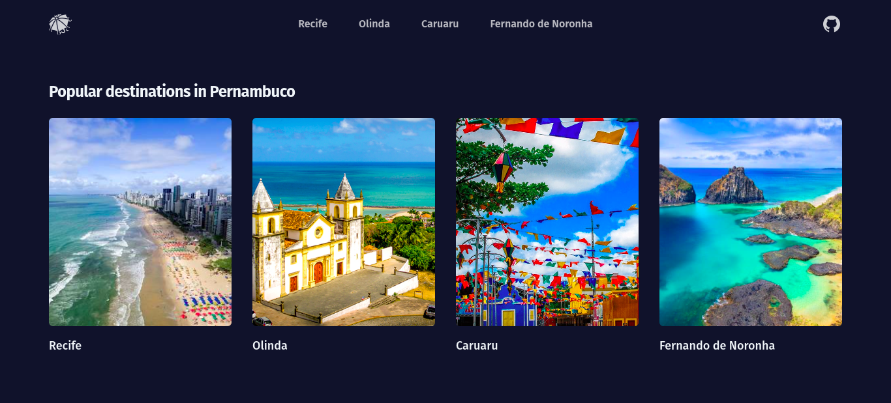

<h1 align="center">
  🌴 Pernambuco Travel App
</h1>

  

 

  

## 💻 Project

Discover Pernambuco's hidden gems with this travel app! Explore the top destinations and unlock unforgettable experiences in this captivating Brazilian state.

## ✨ Technologies

This project was developed using the following technologies:

- [Vite](https://vitejs.dev/)
- [Vue.js](https://vuejs.org/)
- [Vue Router](https://router.vuejs.org/)
- [Tailwind](https://tailwindcss.com/)
- [ES Lint](https://eslint.org/)

## 🛠 Features

✔ Access detailed route of destinations 
✔ Access detailed route of top experiences 
✔ Go back to previous page 
✔ Current route highlighted in the menu 
✔ Not Found Page 

## 📖 Knowledge

With Pernambuco Travel App, I improved my skills in:

- `Vue Router` to configure route settings;
- `Tailwind` to apply styles and create the layout;
- `ESLint` to define code writing standards;

## Project Setup

### 💾 Clone the project

Clone the repository to create a local copy on your computer: 
`$ git clone https://github.com/mmanaclara/vue-school-travel-app.git`

### 🧰 Install dependencies

`$ npm install`

### 🚀 Compile and hot-reload for development

`$ npm run dev`
 
You can now access [`localhost:5173`](http://localhost:5173/) from your browser.
